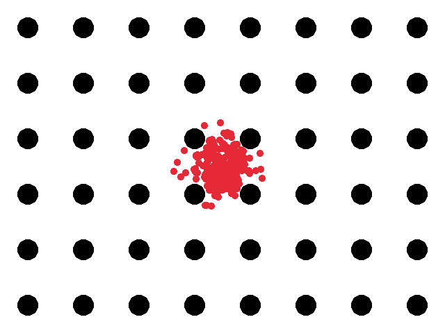
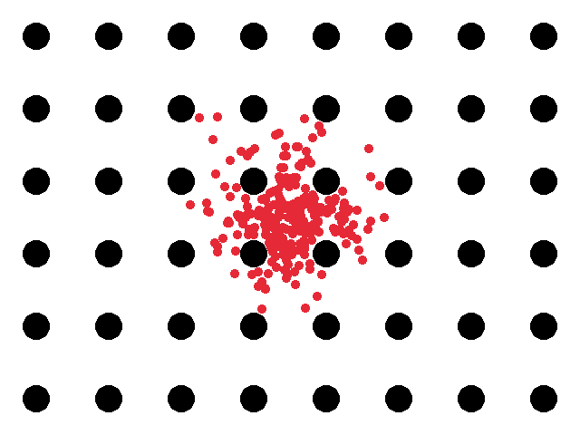
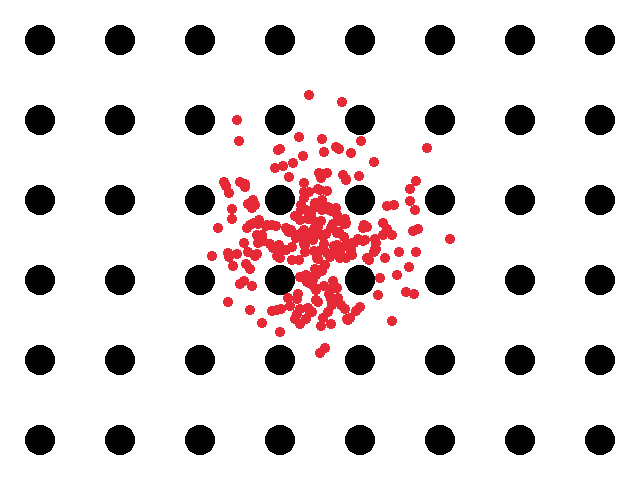
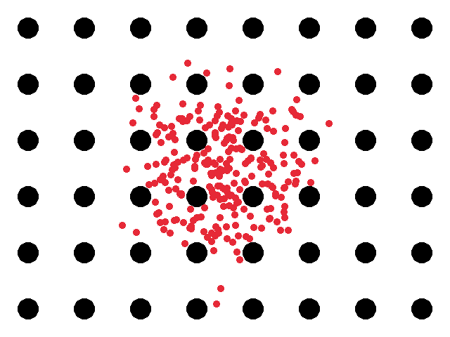

# Collagen Prototype
Visulisation created to simulate bulk water diffusion inside a collagen fibre network (in the radial zone). Now that I
have figured out how to simulate the fibre network, this
method will be applied to my university research project ([Bulk Water Diffusion](https://github.com/justinac0/BulkWaterDiffuse)).

## Showcase

